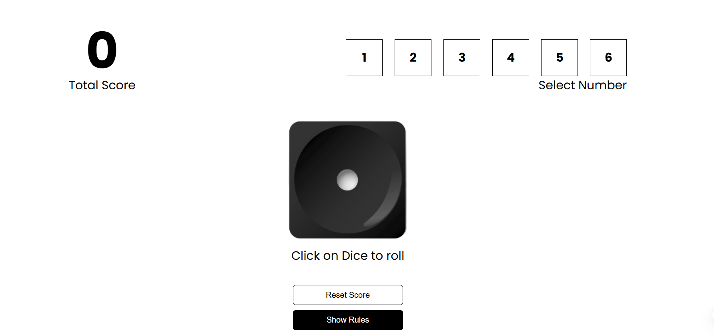

# 🎲 Dice Game

A simple and interactive **single-player Dice Game** built using **React**. The player rolls a virtual dice and the total score accumulates based on the values shown. It's a great example of using state and components in a React project.

<p align="center">
  
</p>

---

## 🕹️ How to Play

- Click on the **Roll Dice** button to roll the dice.
- The number on the dice is added to your score.
- You can keep rolling to increase your score!
- Click on **Reset** to start over.

---

## ✨ Features

- 🎲 Real-time dice roll simulation
- 🔢 Dynamic score update
- 🧹 Reset functionality
- ⚛ React Hooks for state management
- 💡 Simple, clean, and responsive UI

---

## 🛠 Tech Stack

| Tech       | Description                      |
|------------|----------------------------------|
| ⚛ React    | UI library (Functional Components + Hooks) |
| 🎨 CSS      | For styling and layout           |
| 🔧 JavaScript | Game logic and interactivity     |
| ⚡ Vite     | Fast development server and bundler |

---

## 📦 Installation

```bash
# 1. Clone the repository
git clone https://github.com/Bhawanagupta13/Dice-Game.git

# 2. Navigate into the project folder
cd Dice-Game

# 3. Install dependencies
npm install

# 4. Start the development server
npm run dev

# 5. Open your browser and go to
http://localhost:5173
